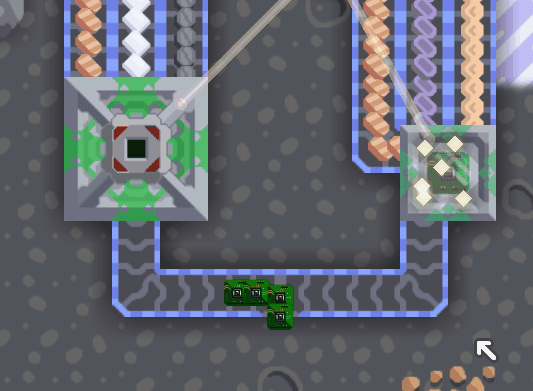

# Cyber IO

___
A Mindustry mod.

## How To Play
### IC Machine
___

### Sender & Receiver
___

### Holo Projector
___

## Author
___
**Programmer:** Liplum

**Painter:** sudoudou233

## Acknowledge
___
**IN NO ORDER**

The friendly people on Mindustry Discord#java whoever ever helped me.

Anyone that commits the issue on GitHub.

Anyone that likes CyberIO. 

## Licence
___
The codes of CyberIO are open source in GNU General Public License v3.0(GPL 3.0).

To learn about the resources of CyberIO, please check the [Copyright file](Copyright.md).