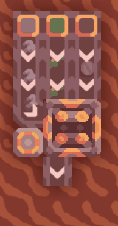
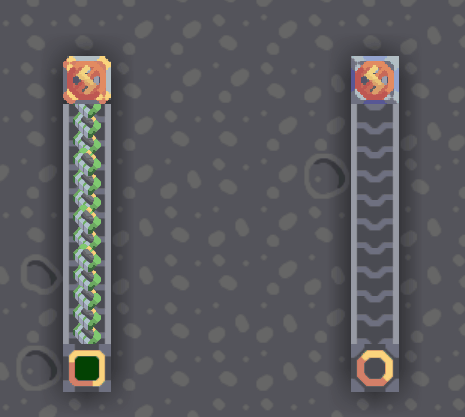
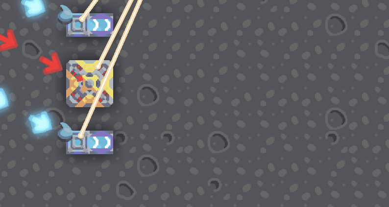

# [Cyber IO](https://liplum.github.io/CyberIO)

[![Badge Discord]][Discord]
[![Badge Download]][Download]

### *The Cybernetics are now on Mindustry V7.*

*Powered by [MGPP](https://github.com/PlumyGames/mgpp)*

___
 

[![Button Website]][Website]
[![Button For Server]][For Server]
[![Button Contribution]][Contribution]

### IC Assembly

___

### Sender & Receiver

___

### Hologram Projector

## Acknowledgements

### Main

<kbd>       Liplum       </kbd> 
<kbd>       [sudoudou233](https://github.com/sudoudou233)       </kbd>   

### Sprites

<kbd>       [Eclipse](https://github.com/Eclipse-04)       </kbd>   

### Translation
 

<kbd>       [Ukrainian] [Prosta4okua](https://github.com/Prosta4okua)       </kbd>   
<kbd>       [Chinese Simplified] [woodjecket](https://github.com/woodjecket)       </kbd>   
<kbd>       [Japanese] [Sakuranokwa](https://github.com/Sakuranokwa)       </kbd>

 

___

## Licence

The code of CyberIO is open source under GNU General Public License v3.0 (GPL 3.0).

To learn about the resources of CyberIO, please check the [Copyright](COPYRIGHT.md).

<!----------------------------------------------------------------------------->

[Discord]: https://discord.gg/PDwyxM3waw

[Download]: https://github.com/liplum/CyberIO/releases/latest

[Website]: https://liplum.github.io/CyberIO

[For Server]: Info/ForServer.md

[Contribution]: CONTRIBUTING.md

<!----------------------------------[ Badges ]--------------------------------->

[Badge Discord]: https://img.shields.io/discord/937228972041842718?color=454fc1&label=Discord&logo=Discord&style=for-the-badge&logoColor=white&labelColor=5865F2

[Badge Download]: https://img.shields.io/github/downloads/liplum/CyberIO/total?color=023a46&label=Download&logo=docusign&logoColor=white&style=for-the-badge&labelColor=034e5e

<!---------------------------------[ Buttons ]--------------------------------->

[Button Website]: https://img.shields.io/badge/Website-428813?style=for-the-badge&logoColor=white&logo=GitBook

[Button For Server]: https://img.shields.io/badge/For_Server-AA344D?style=for-the-badge&logoColor=white&logo=iCloud

[Button Contribution]: https://img.shields.io/badge/Contribution-097399?style=for-the-badge&logoColor=white&logo=ChatBot
