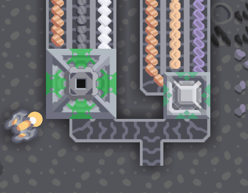
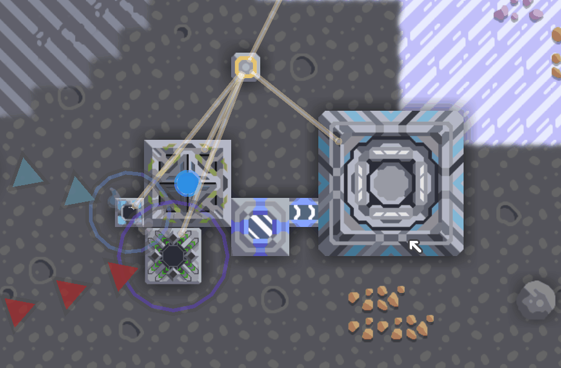

# Cyber IO 

A Mindustry v7 mod provides lots of cybernetic things!!!
___

#### How To Play

To learn about playing Cyber IO, you can check [the wiki of Cyber IO](https://github.com/liplum/CyberIO/wiki/Game-Guide)
.

#### Mod Compatibility

If you'd like to play a mod pack, [there is a rough test](SafelyWorkWith.md) of inter-mod compatibility as a reference
for you.
*Note: Every mod could update and might break the result, please think and test on your own.*

#### For Server

Please [check this file](ForServer.md) to learn more about running Cyber IO on a server.
___

### IC Machine

___

### Sender & Receiver

___

### Hologram Projector

___

## Author

**Programmer:** Liplum

**Painter:** sudoudou233
___

## Acknowledgement

**IN NO ORDER**

* The friendly people on Discord whoever have ever helped me.

* Anyone who committed the issue or made pull request on GitHub.

* Anyone who likes CyberIO.

### For Contributors

Everyone is welcome to contribute Cyber IO.

If you want to translate or programme cooperatively. Please [check this file](ForContributors.md) to learn how to join us.
___

## Licence

The codes of CyberIO are open source in GNU General Public License v3.0 (GPL 3.0).

To learn about the resources of CyberIO, please check the [Copyright File](Copyright.md).