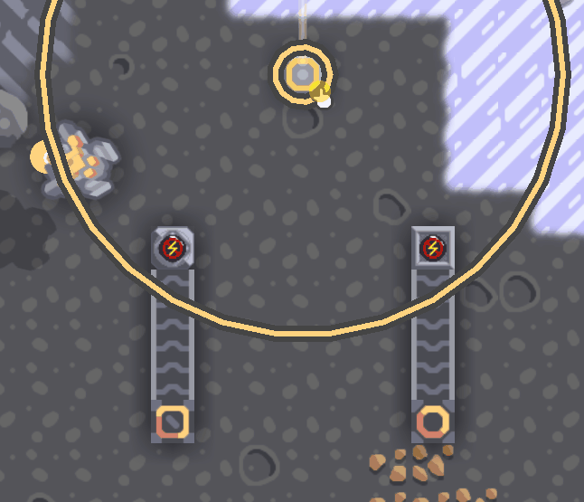
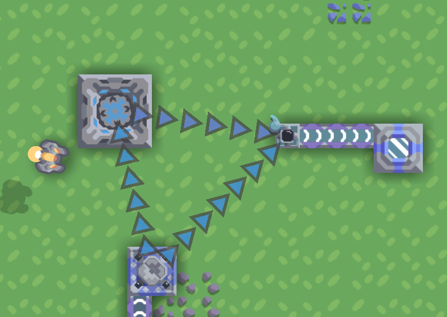
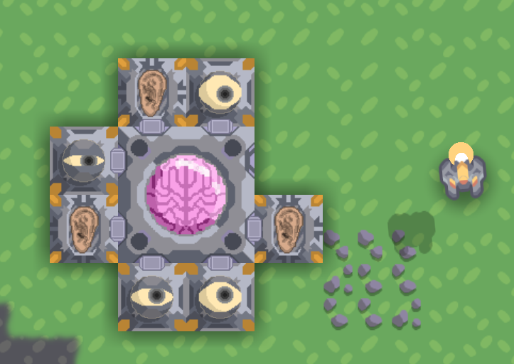

# Cyber IO

# Plum Star Inc.

Your company, Plum Star Inc., mainly develops holographic technology and cross-space data transmission.

## Data Transimission
### Sender & Receiver

Sender&Receiver can be connected each other thanks to the Internet of Things(IoT). Of course, they still need electricity like other gadgets.

Because Sender&Receiver use peer to peer(P2P), one sender can only connects with one receiver, while one receiver could establish more connections.

They will automatically detect whether there is any data flowed and display the state on its screen.
### Streaming

Plum Star Inc. built the universe's largest streaming server. That supports you startup server on your own, as the server you built is just a (Content delivery network)CDN server of it.
### Intelligent Logistics

Smart unloader will detect the requirement of a receiver, or a smart distributor in this case, then unload the surrounding containers and send corresponding data to the target.
Smart distributor only allows the data that factorys nearby need.

Therefore, combining them appropriately could boost the productivity of your industries.

## Holographic Projection
### Holograpgic Projector

Holographic projector consumes cyberion, a liquid, and projects countless holographic units.
There are many different kinds of holo-units, such as holo-miner and holo-fighter, who can perform various arduous tasks for you.

When it comes to the little one, they ~~are cute~~ can do many dirt works, but unfortunately, they are disposable, because cyberion in their images is consumed over time.

Nevertheless, they are cheap and it's the best choice to assist you.

More holographic units are still in development, please continue following the progress of Plum Star Inc.

# New Brains Crop.

The counterpart of Plum Star Inc. has the leading position of biotech, medicine and brain science.

## Heimdall Project

To build a modular person, Heimdall Project was launched.

By extracorporeal life support, New Brains Crop. made every Physical Component can survival standalone.

With the brain-computer interface, The brain, main part, can be improved by other upgrade componets and gains more abilities if the combination or formation is right.

Some studys mentioned that Heimdall Project might have the ability to control people's mind, but New Brains Crop. denied this.

More upgrade componets are still in development.

## ???
New Brains Crop. is yet to provide more at present. Please wait for any infomation revealed.